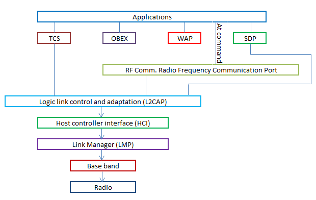

### Bluetooth Architecture
The protocol architecture of Bluetooth is given below:

.

*Fig 1. Bluetooth Architecture*

* The radio layer is responsible for:
    *  Modulation/Demodulation of data for transmitting (OR) receiving over air.
* The base band layer is responsible for:
    *  Controlling the physical links via radio
    *  Assembling the packets
    *  Controlling frequency hopping.
* The link manager protocol controls and configures links to other devices.
* The host controller interface(HCI) handles communication between the host and the module. For this purpose, it uses several HCI command packets such as the even packets and data packets. The L2CAP layer converts the data obtained from higher layers into packets of different sizes.
* The RF COMM provides a serial interface with wireless application protocol (WAP) and object exchange(OBEX).
* WAP and OBEX provide interface to other communications protocols.
* The TCS(Telephone control protocol specification) provide telephony service.
* The SDP(Service discovery protocol) allows the devices to discover the services available on another Bluetooth enabled device.
* The applications present in the application layer can extract the services of the lower layers by using one of the many profiles available.

##### References : 

[1. http://www.swiftutors.com/bluetooth-introduction.html]( http://www.swiftutors.com/bluetooth-introduction.html)
